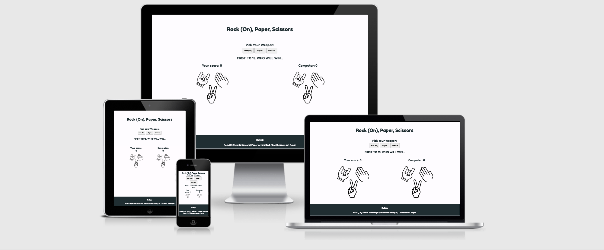
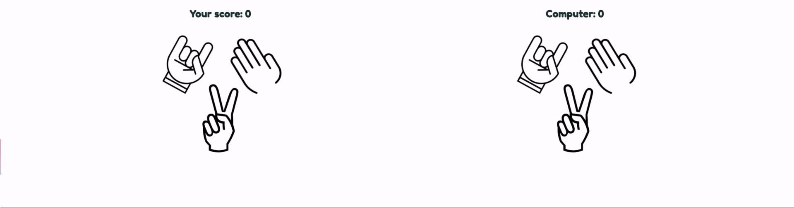
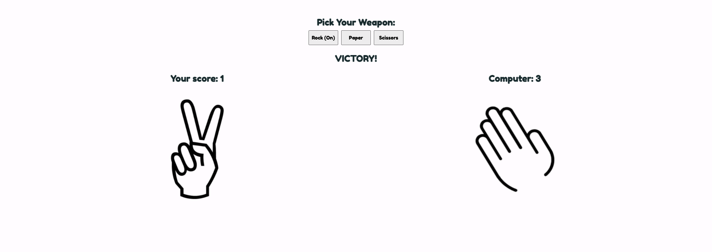
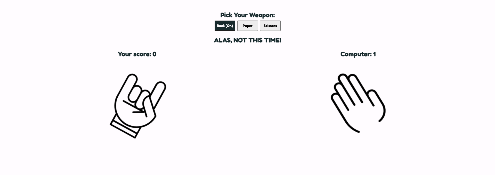
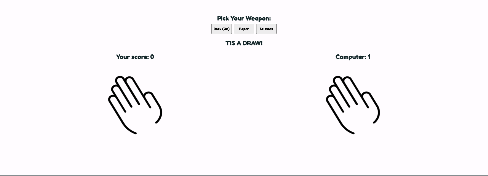

# **Rock (On), Paper, Scissors**

# **Introduction**

Rock (On), Paper, Scissors was created as a fun take on the traditional game of Rock, Paper, Scissors, while sticking to the same core concepts as the original. The game is a user vs computer simulation and offers the user the choice of 3 variables; Rock (On), Paper or Scissors. The script I've written randomly selects one of the 3 options on the computers behalf. The rules are simple, Rock (On) blunts Scissors, Paper covers Rock (On) and Scissors cut Paper. The user will score 1 point for every winning selection, the computer scores 1 point for every winning random selection and neither opponent scores a point if it's a tie. The winner of the game is determined by whoever reaches 15 first.

The live site can be accessed [here.](https://digitilley.github.io/rock-paper-scissors/)

# **Design**

## **Color Pallete**
- The two main colours used are #FFFCFF and #1B2F33 
- I chose these colours as I knew they'd meet accessibility guidelines and I personally liked them.

## **Typography**
- The Fredoka One font is used throughout with Sans-Serif as the backup.
- I chose Fredoka One because it had a casual, playfullness about it.

## **Initial Concept**
- The initial concept was designed first to structure the layout of the content and media that was envisaged.
- I had originally wanted to include a best of 15 scoreboard but unfortunately had to limit this due to time constraints.

# **Features**
This section covers the features used for the website to function seemlessly, ensuring accessibility requirements are achieved at the same time.

## **Existing Features**
### Header
- I designed the Header to be large and to the point so that it would immediately grab the users attention and explain what the site is offering. 

### Game Area

- The Game Area consists of a description of what the user should do, 3 options to chose from in the form of buttons and the text "Who will win..."
 - I kept the design simple, again, to ensure the user knew exactly what to expect from the offset.

### Score Area
- The Score Area provides a score board that changes depending on the result of the users selection. For every win, the user recieves 1 point. For every loss, the computer receives 1 point, and for every draw, the score remains the same.
- In addition to this, upon selecting an item, the users image will change to match, as will the randomly selected computer image. Depending on win, lose, or draw, the text will change to tell the user what the result was.

### Footer
- The Footer includes the rules of the game for those that aren't already aware.

# **Validator Testing**
### HTML
- No errors were returned when passing through the official [W3C Validator](https://validator.w3.org/nu/#textarea)

